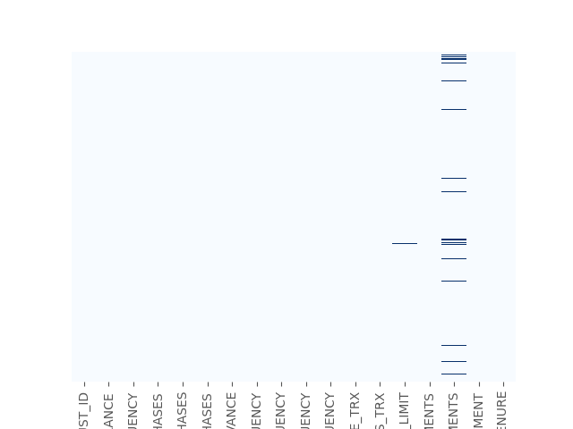
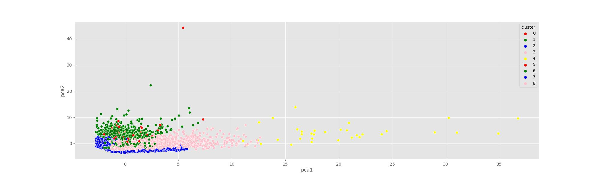

# 
Bank Customer Profiling and Segmentation

## PROJECT OVERVIEW

In this case study, I am a consultant to a bank in New York City. The bank has extensive data on their customers for the past 6 months. The marketing team at the bank wants to launch a targeted ad marketing campaign by dividing their customers into at least 3 distinctive groups.

One of the key pain points for marketers is to `know their customers` and `identify their needs`. By understanding the customer, marketers can launch a targeted marketing campaign that is tailored for specific needs. If data about the customers is available, data science can be applied to perform market segmentation.

#### What we will do - 

* In this project, you have been hired as a data scientist at a bank and you have been provided with extensive data on the bank's customers for the past 6 months.
* Data includes transactions frequency, amount, tenure..etc.
* The bank marketing team would like to leverage AI/ML to `launch a targeted marketing ad campaign` that is tailored to specific group of customers.
* In order for this campaign to be successful, the bank has to `divide its customers into at least 3 distinctive groups`.
* This process is known as `marketing segmentation` and it crucial for `maximizing marketing campaign conversion rate`.

## TABLE OF CONTENTS
<table>
  <tr>
    <th>Sr No:</th>
    <th>Topic</th>
  </tr>
  <tr>
    <td>1</td>
    <td>Performed Data Analysis</td>
  </tr>
  <tr>
    <td>2</td>
    <td>Data Visualization</td>
  </tr>
 <tr>
    <td>3</td>
    <td>Feature Engineering</td>
  </tr>
   <tr>
    <td>4</td>
    <td>Implemented Feature Selection - Random Forest Feature Elimination and Lasso Feature Elimination</td>
  </tr>
     <tr>
    <td>5</td>
    <td>Principal Component Analysis (PCA)</td>
  </tr>
  <tr>
    <td>6</td>
    <td>Applying K-Means and Hierarchical clustering</td>
  </tr>
</table>

## DATA DESCRIPTIION

The data source is collected from `Kaggle` - https://www.kaggle.com/arjunbhasin2013/ccdata

1. CUSTID: Identification of Credit Card holder
2. BALANCE: Balance amount left in customer's account to make purchases
3. BALANCE_FREQUENCY: How frequently the Balance is updated, score between 0 and 1 (1 = frequently updated, 0 = not frequently updated)
4. PURCHASES: Amount of purchases made from account
5. ONEOFFPURCHASES: Maximum purchase amount done in one-go
6. INSTALLMENTS_PURCHASES: Amount of purchase done in installment
7. CASH_ADVANCE: Cash in advance given by the user
8. PURCHASES_FREQUENCY: How frequently the Purchases are being made, score between 0 and 1 (1 = frequently purchased, 0 = not frequently purchased)
9. ONEOFF_PURCHASES_FREQUENCY: How frequently Purchases are happening in one-go (1 = frequently purchased, 0 = not frequently purchased)
10. PURCHASES_INSTALLMENTS_FREQUENCY: How frequently purchases in installments are being done (1 = frequently done, 0 = not frequently done)
11. CASH_ADVANCE_FREQUENCY: How frequently the cash in advance being paid
12. CASH_ADVANCE_TRX: Number of Transactions made with "Cash in Advance"
13. PURCHASES_TRX: Number of purchase transactions made
14. CREDIT_LIMIT: Limit of Credit Card for user
15. PAYMENTS: Amount of Payment done by user
16. MINIMUM_PAYMENTS: Minimum amount of payments made by user
17. PRC_FULL_PAYMENT: Percent of full payment paid by user
18. TENURE: Tenure of credit card service for user

## 1. PERFORMING DATA ANALYSIS

So, to start with our problem, we will clean the dataset by checking for null values, handling outliers, checking for data consistency

A) Describing the data

#### Insights

1. Mean balance is $1564
2. Balance frequency is frequently updated on average ~0.9
3. Purchases average is $1000
4. one off purchase average is ~$600
5. Average purchases frequency is around 0.5
6. average ONEOFF_PURCHASES_FREQUENCY, PURCHASES_INSTALLMENTS_FREQUENCY, and CASH_ADVANCE_FREQUENCY are generally low
7. Average credit limit ~ 4500
8. Percent of full payment is 15%
9. Average tenure is 11 years

B) Checking for missing values - 

So, we are having Missing values in `Minimum Payment` and `Credit Limit` Attribute. So, we decide to impute with `KNN Imputer` values where each sample’s missing values are imputed using the mean value from n_neighbors nearest neighbors found in the training set.

C) Checked for Outliers - 

D) Dropping Irrelevant Attributes - 

In this step, we will drop irrelevant or Inconistent Attributes from our dataset.

## 2. DATA VISUALIZATION

A) Kernal Density Plot - 

#### Insights

1. Mean of balance is 1500 dollors
2. 'Balance_Frequency' for most customers is updated frequently ~1
3. For 'PURCHASES_FREQUENCY', there are two distinct group of customers
4. For 'ONEOFF_PURCHASES_FREQUENCY' and 'PURCHASES_INSTALLMENT_FREQUENCY' most users don't do one off puchases or installment purchases frequently 
5. Very small number of customers pay their balance in full 'PRC_FULL_PAYMENT'~0
6. Credit limit average is around $4500
7. Most customers are ~11 years tenure

B) Heatmap - For performing Correlation analysis

#### Insights

1. 'PURCHASES' have high correlation between one-off purchases, 'installment purchases, purchase transactions, credit limit and payments. 
2. Strong Positive Correlation between 'PURCHASES_FREQUENCY' and 'PURCHASES_INSTALLMENT_FREQUENCY'

## 3. FEATURE ENGINEERING

## 4. FEATURE SELECTION

## 5. PRINCIPAL COMPONENT ANALYSIS (PCA)

1. PCA is an unsupervised machine learning algorithm.
2. PCA performs dimensionality reductions while attempting at keeping the original
3. PCA works by trying to find a new set of features called components. 
4. Components are composites of the uncorrelated given input features.

## 6. APPLYING CUSTERING TECHNIQUES - K-MEANS AND HIERARCHICAL CLUSTERING

#### 6.1 K-Means Clustering - 

`K-means` is an unsupervised learning algorithm (clustering). K-means works by grouping some data points together (clustering) in an unsupervised. The algorithm groups observations with similar attribute values together by measuring the Euclidian distance between points.

#### K-Means Algorithm - 

1. Choose number of clusters "K"
2. Select random K points that are going to be the centroids for each cluster
3. Assign each data point to the nearest centroid, doing so will enable us to create "K" number of clusters
4. Calculate a new centroid for each cluster 5. Reassign each data point to the new closest centroid
6. Go to step 4 and repeat.

#### 6.2 Hierarchical Clustering - 

 https://www.analyticsvidhya.com/blog/2021/03/customer-profiling-and-segmentation-an-analytical-approach-to-business-strategy-in-retail-banking/

 https://github.com/Praneel-Rastogi/Bank-Customer-Segmentation

 
